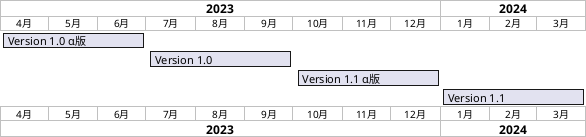

# 開発のすすめかた

ここでは、開発の進め方について説明する。

## 開発方針

ソフトウェアの品質向上のために以下のような施策を考える
* オープンソースの採用
* 最新技術の採用
* 開発プロセスの自動化

中でも日本のソフトウェア開発では開発プロセスの自動化の取り組みが遅れており、注意が必要である。本プロジェクトでは開発プロセスの自動化を最重要課題とする。
逆に、一般的な品質向上施策、セキュリテイ向上施策については、標準化や基準に基づいた盲目的な対応になりがちであり、再考が必要である。本プロジェクトでは、個々の施策ごとにコスト対効果を評価して実施の可否を判断することで真に社会貢献となるソフトウェアの開発を目指す。

## ロードマップ

以下に開発のロードマップを示す。




### Version 1.0 α版

#### 期間

2023/4/1-2023/6/30

#### 目標

トリアージと基礎技術調査：成果物は OSS層の仕様書、マニュアルモックシステム

### Version 1.0

#### 期間

2023/7/1-2023/9/30

#### 目標

PoC 開発、サンプルレベルのアプリケーションの動作

### Version 1.1 α版

#### 期間

2023/10/1-2024/12/31

#### 目標

基本的なガジェット、infoScoop, ID Manager を開発し、製品としてα版のリリース

### Version 1.1

#### 期間

2024/1/1-2024/3/31

#### 目標

パイロットユーザ向けのカスタマイズ、ガジェット、プロビジョニングを開発

### Version 1.2

grpc, http3 などの最新技術は 2023 年4月時点で取り組むには時期尚早であるため、これらの技術を採用したバージョンを 2024年に開発する。

#### 期間

2024/4/1-2024/9/30

#### 目標

互換性を維持しながら grpc, http3 のサポートに取り組んで性能向上を狙う

## トリアージ

* 開発の早期の段階で要件のリストを作成し、各要件の難易度を検討する
* 難易度は2人月以上(S), 1人月以上(A), 2週間以上(B), 1週間以上(C), 3日以上(D), 1日以上(E), 1日未満(F) というように工数の概算の対数でランク分けして表示する
* 要件の親子関係をもたせることも可能とする
* 実装するか否か、する場合はどのマイルストーンで実装するかを決定する
* 一般的な要件定義, 課題管理と以下の点で異なる
  * 項目ごとに難易度（＝概算工数）が必須である
  * 実装しない要件も記載する
  * すべてを最初からやるのではなく、スコープを分け、要件ごとにマイルストーンを設定する
  * ウォータフォールではなく、途中でリストに追加したりトリアージの結果を変更できる
  * トリアージの変更は利害関係者のレビューを必須とする


## 脆弱性対応

* [trivy](https://github.com/aquasecurity/trivy) による脆弱性診断で検出０件を目標とする
* ソースコードのリポジトリには github を使用し、そこで dependabot サービスを使用して常時脆弱性を監視する

trivy によるチェックは github action および VS Code に入れて実施する。

## logging

ログ出力には [pino](https://getpino.io/#/)を使用する。

### デバッグログ
ブラウザ上のデバッグログをサーバ側にアップロードできること。pino の custormTransport で実装する。

#### 背景
SPA はクライアント側で動作するので、ユーザが利用中に想定外のエラーが発生した場合にブラウザのコンソールを見ることができないので、デバッグが難しい。

#### 詳細
* デバッグログをブラウザの local storage に蓄積し、 critical な例外が発生した際ににサーバにアップロードすること
* 蓄積しているデバッグログをユーザ操作により、ブラウザ上で表示したり、サーバにアップロードすることができること
* デバッグログは上限サイズ(100Kくらい？）をこえたところでローテートし、一定量（3個くらい）以上はたまらないようにすること

## devDependency
本番稼働環境にデプロイする場合に package.json の devDependency のモジュールが node_modules にインストールされないようにすること。

* yarn publish だと入らない?（未検証）
* コンテナ内に git clone して npm ci するとかだと入ってしまうので、 --production とか --omit=dev などをつけてインストールを避けること

## テスト自動化
テストを自動化すること。

* モジュール内単体テストは jest でテストすること
* REST API レベルのテストは jest-rest でテストすること
* Gadget のテストは Playwright などのヘッドレスブラウザで実行すること

## TDD
テスト駆動型開発を実施すること。すべての開発は以下の手順で実施する。

1. テスト項目書を書く
1. 利害関係者にテスト項目書をレビューしてもらう
1. テストプログラムを書く
1. テストを実行してテストが失敗することを確認する
1. コーディングしてテストが成功するまでデバッグする

ただし、Playwright によるテスト自動化は修正に対するコストが高いため、テストプログラムの代わりにテスト手順書を書くこととする。
* テスト手順書をマニュアルの操作例とすることが推奨される。
* Playwright によるテスト自動化は仕様が Fix してから、別作業として実施する。

## 文書の自動化
できるだけ、ドキュメントをソースコードから生成すること。

* API仕様書（swagger.yml)
* 仕様書、運用手順書（Markdownで作成後、Jinja2 でパラメータ埋め込み、有効化されてない機能の削除）

### 詳細
REST API については、 swagger.yml を生成すること。 example をふんだんに含めること。
APIをライブラリ提供する場合は TSDoc でソースコード中のコメントからドキュメントを生成すること。

## node.js のバージョン

node.js のバージョンは v18 を利用する。
node.js 20系は2024年春に保守状態に入る[計画](https://nodejs.dev/en/about/releases/)なので、Version 1.2 では node.js 20系に移行する。
package.json に以下の記述を追加すること。

```json
  "engines": {
    "node": ">=18"
  },
```

.npmrc に以下を記述すること。

```
engine-strict = true
```

## パッケージマネージャ

以前は npm にいろいろ問題があったため yarn や pnpm などのサードパーティ製のパッケージマネージャが開発された経緯があるが、
現在は npm も十分に改善されて問題になるほどの差異は無い。
開発者間の互換性を考慮して npm を使用すること。

## モジュール形式

teigi およびそのパッケージとしてリリースするモジュールの形式は node.js とクライアントで共用するため、 ESM を使用する。
CJS, UMD は使用してはならない。
package.json に以下の記述を追加するか .mjs, .mts の拡張子を使用し、 ESM 対応の export を行うこと。

```json
  "type": "module"
```


## typescript

typescript 5系を使用する。tsconfig.json については、[Centralized Recommendations for TSConfig bases](https://github.com/tsconfig/bases)の中から適切なものを選ぶ。

 node.js のプロジェクトの package.json scripts 定義は以下の通りとする。

```json
  "scripts": {
    "build": "tsc -p tsconfig.json",
    "start": "ts-node --esm index.ts"
  }
```

### API Server
サーバサイドのプログラムについては、 @tsconfig/{node18,strictest,esm} を使用する。

```bash
yarn add --dev @tsconfig/node18-strictest
```

tsconfig.json:
```json
{
  "$schema": "https://json.schemastore.org/tsconfig",
  "display": "API Server",
  "extends": ["@tsconfig/node18/tsconfig.json", "@tsconfig/strictest/tsconfig.json", "@tsconfig/esm/tsconfig.json"]
}
```

ただし、JSONファイルの import を含む場合は以下のようにする必要がある。
```json
{
    "$schema": "https://json.schemastore.org/tsconfig",
    "display": "API Server",
    "extends": ["@tsconfig/node18/tsconfig.json", "@tsconfig/strictest/tsconfig.json"],
    "compilerOptions": {
        "verbatimModuleSyntax": false,
        "module": "nodenext", 
        "resolveJsonModule": true
    }
}
```

ただし、 ts-node の https://github.com/TypeStrong/ts-node/issues/1954 が解決しないと extends に配列を指定する記法は使えない。
ts-node のリリースがあるまでは、 node18-strict-esm, node18-strict を使用する。

### React

クライアント側 vue.js については、 @tsconfig/create-react-app を使用する。

```bash
yarn add --dev @tsconfig/create-react-app
```

tsconfig.json:
```json
{
  "$schema": "https://json.schemastore.org/tsconfig",
  "display": "React Appliacation",
  "extends": "@tsconfig/create-react-app/tsconfig.json"
}
```
## 国際化

国際化(i18n)対応とする。ソースコード上は英語を使用し、クライアントでは国際化対応で翻訳したものを表示する。
サーバのログ、エラーメッセージは国際化対応を行わず、英語のまま出力されることとする。