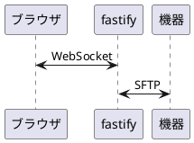

# SFTP接続
fastifyとブラウザでWebSocketで接続を行い、それと1対1対応でfastifyが接続先とSFTP接続を行うことで実装している。

## 通信フォーマット
送受信どちらも文字列化されたJSONオブジェクトで行う。
パラメータには`type`と、それに応じて必要なパラメータが与えられる。

### 送信

| `type` | 追加パラメータ | レスポンス内容                         |
|--------|----------------|----------------------------------------|
| `gethome`    |                | 接続先のホームディレクトリを取得する。 |
| `readdir`    | `path`               | `path`で指定されたパスのファイル一覧を取得する。 |
| `unlink`    | `path`               | `path`で指定されたパスのファイル/シンボリックリンクを削除する。 |
| `mkdir`    | `path`               | `path`で指定されたパスでディレクトリを作成する。|
| `rmdir`    | `path`               | `path`で指定されたパスのディレクトリを削除する。|
| `delete`    | `path`               | `path`で指定されたパスのファイル/シンボリックリンク/ディレクトリを削除する。|
| `transfer`    | `id`,`uuid`,`cwd`,`dirId`               | `id`の一文字目が`"/"`の場合は接続先からファイルサーバへファイルが転送され、それ以外の場合はファイルサーバから接続先へ転送される。|

### 受信

| `type` | 追加パラメータ | レスポンス内容                         |
|--------|----------------|----------------------------------------|
| `serverReady`    |                | SSH接続が完了した際にfastifyサーバから送信される。|
| `gethomeRes`    |   `text`             | `text`にホームディレクトリが格納されている。 |
| `readdirRes`    | `path`,`list`               | `list`にファイル一覧が格納されており、`path`は`readdir`のものがそのまま返される。 |
| `unlinkRes`    | `path`               | 削除が完了すると送信される。`path`は`unlink`のものがそのまま送信される。 |
| `mkdirRes`    | `path`               | ディレクトリ作成が完了すると送信される。`path`は`mkdir`のものがそのまま送信される。。|
| `rmdirRes`    | `path`               | 削除が完了すると送信される。`path`は`rmdir`のものがそのまま送信される。|
| `deleteRes`    | `path`               |削除が完了すると送信される。`path`は`delete`のものがそのまま送信される。|
| `transfer`    | `id`,`uuid`,`cwd`,`dirId`               | `id`の一文字目が`"/"`の場合は接続先からファイルサーバへファイルが転送され、それ以外の場合はファイルサーバから接続先へ転送される。|