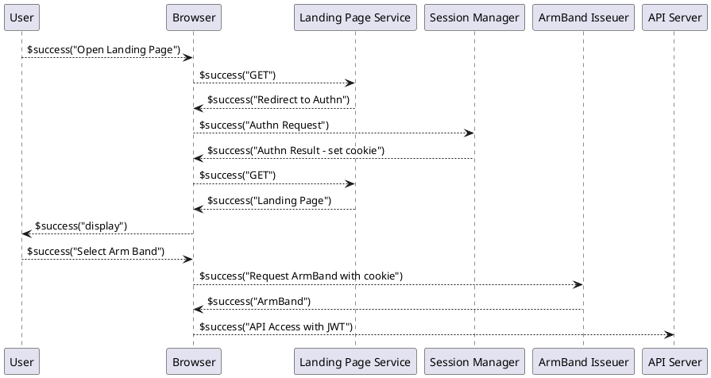

# 認証と認可

teigi 上のサービスの認証は、以下の２段階で行われます。

* 利用者の一連の Web UI へのアクセスについて、その利用者IDを特定した上でセッションとして管理
* その利用者がどのような属性を持つかを決定してその属性を保持するアクセストークン（以降、腕章と呼ぶ）の発行

認可は腕章に記録されている利用者の属性とリソース、ユースケースを照合することで実施されます。

## セッションマネージャ

セッションマネージャは、利用者の一連の Web UI へのアクセスについて、その利用者を特定した上でセッションとして管理します。セッションごとに固有の Cookie を発行し、ブラウザに Set-Cookie ヘッダーでセットします。
セッションマネージャが発行する Cookie は http-only 属性が付与されており、API呼び出しに Bearer トークンとして直接利用することはできません。

## ゲスト認証

ログインが不要な認証です。最初のアクセス時に有効期間の長い Cookie を発行します。アクセストークン発行サービスはゲストの Cookie の内容を見てゲスト用のアクセストークンを発行します。

## SAML認証

ユーザがWeb ブラウザからアクセスする場合、 teigi 上のアクセストークン発行サービスは SAML SP として動作します。

## クライアント証明書

## 腕章

腕章は利用者がどのような役割でサービス群にアクセスするかを示すものであり、一人の利用者が複数の腕章を切り替えて使用できます。
特に特権アクセスへの切り替えや兼務での切り替えがある場合はナビゲーションバーで現在の腕章を識別しやすいようにすることで、利用者の操作ミスを防ぐ効果をもたせます。

アクセストークンには複数の腕章が含まれています。具体的には JWT の ab 属性にサービス名をキーとして腕章オブジェクトが入ります。

### 腕章オブジェクト

腕章オブジェクトには以下の属性が設定されます。

 |属性名|意味|
|--|--|
|role|そのサービスにアクセスするときの役割|

