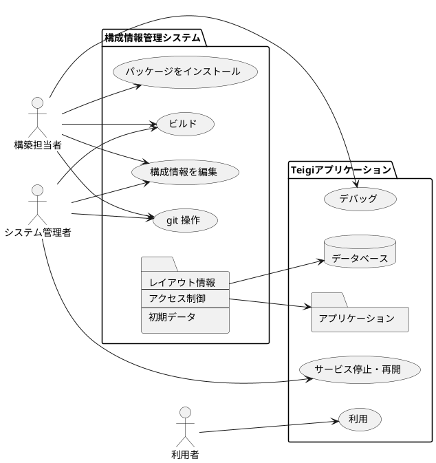

# 構成情報

Teigi のアプリケーション構成情報は Teigi パッケージマネージャにより管理されます。
Teigi パッケージマネージャは構成情報を git で管理します。

git のサーバを運用することによって、検証環境と本番環境の差分を管理できます。

## ファイルの種類

パッケージマネージャが管理するファイルはオブジェクトタイプとそれ以外に別れます。
オブジェクトタイプが yml のものはパッケージオブジェクトと呼ばれ、パッケージマネージャによる特殊なマージ処理が行われます。

## パッケージマネージャ

パッケージマネージャは以下の手順でインストールを実行します。

1. パッケージの依存関係の解決
1. パッケージオブジェクトのロード
1. パッケージオブジェクトの補正処理
1. パッケージオブジェクトのバリデーションチェック
1. パッケージオブジェクトのデフォルト値削除処理

### パッケージオブジェクトのインストールタイプ

パッケージ内のオブジェクトにはオブジェクトごとにインストールタイプがある。

### 追加

_installType 属性が省略されている場合、オブジェクトは追加モードとなります。

### マージ

パッケージマネージャは複数のパッケージ間で同じ Key を持つオブジェクトをマージして参照できます。マージでは以下の機能を提供します。
- オブジェクトの追加・削除
- 属性値の上書き
- 内包オブジェクトの再帰的マージ
- 順序付き配列への要素の追加、削除

## パーソナライゼーション

以下の項目については、ブラウザの local storage やサーバ側データベースにパラメータを保存することでパーソナライゼーション機能を提供します。

* ガジェットの配置
* お気に入りメニューの内容
* 一覧表示ガジェットの検索パラメータ、ソート順、カラムの表示非表示

ユーザが設定を変更するとブラウザの local storage にパラメータが保存されます。その後、ユーザは現在の設定を組織や個人のデフォルト値としてサーバ側データベースに保存することができます。
ガジェットが構成情報を対象としている場合はパーソナライゼーションはサーバ側データベースへの保存はできません。
サーバ側データベースのデフォルト値とブラウザの local storage にパーソナライゼーションの内容が異なる場合は、ブラウザの local storage の内容が優先されます。ガジェットやページの設定をリセットすることで、サーバ側データベースのデフォルト値に合わせることができます。また、サーバ側データベースに保存されている設定を削除することで、製品のデフォルト値に戻すことができます。