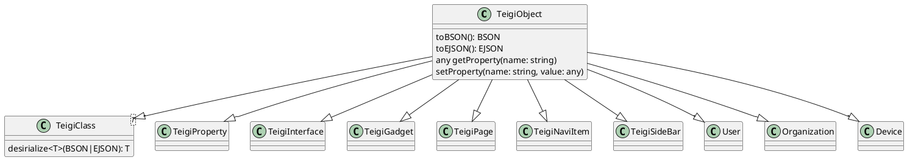

# オブジェクト

Teigi のデータはすべてBSONにシリアライズ可能な JavaScript のオブジェクトです。
* Mongo DB には BSONにシリアライズして格納されます
* オブジェクトのサイズは BSON にシリアライズして  16MB(16,000,000 bytes)未満でなければなりません
* メモリ上にロードされたときは JavaScript のオブジェクトとなります
* テキストにシリアライズする場合はEJSON v2 でシリアライズされます
* REST API で外部公開する場合は、通常のJSONへの変換が行われます
* 画像、暗号化データも BSON の $binary で保持できます

## TypeScript

Teigi のオブジェクトは TypeScript では TeigiObject クラスを継承します。
EJSON、BSONからデシリアライズでき、EJSON、BSONにシリアライズできます。

## REST API

REST API で流通する場合は、EJSON、JSONのいずれかの形式を選択できます。
JSONを TeigiObject にデシリアライズする場合は、値の型を確定するためにスキーマ情報が必要です。
スキーマー情報で値の型を確定できない場合はエラーになります。

## データベースとコレクション

Teigi のデータはすべてデータベース teigi に種別ごとにコレクションに分けて格納されます。
ここで種別は Teigi オブジェクトのクラスの派生構造の第一階層となります。

