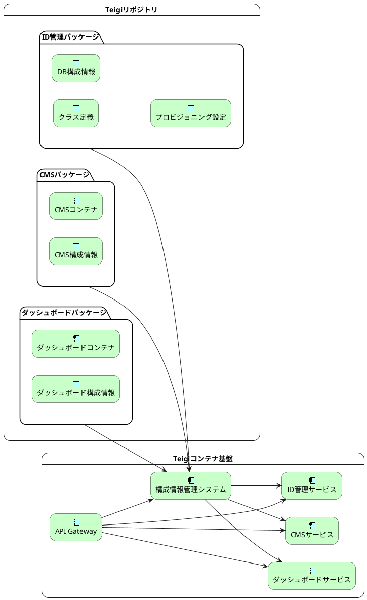
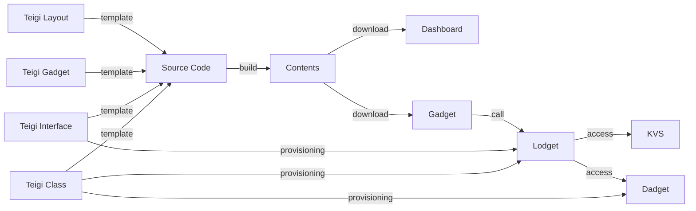

# Overview

Teigi は様々なパッケージをインストールすることでアプリケーションを追加することができるローコードアプリケーションフレームワークです。

## プロビジョニング

Teigi は、アプリケーションを定義するオブジェクトからアプリケーションの実行用のソースコード、構成情報、アクセス制御情報、バージョン変換ツールなどを生成し、各種実行エンジンに展開するローコード開発ツールです。この展開のことをプロビジョニングと呼びます。

オブジェクトから各種のコンピューティング、ネットワーキングリソースにプロビジョニングすることにより、リソースの構成情報、パラメータ、スキーマ、プロトコル、アクセス制御などの情報をアプリケーション管理者が扱いたい単位でオブジェクトとしてまとめることができます。たとえば、「ユーザには社員番号という属性があり、英字2文字の雇用種別コードと4桁の数字からなる」という情報はユーザ情報を編集する画面の入力フィールドの設計、APIの入力値バリデーション、データベースのスキーマなどいろいろな場所で必要となります。これをユーザのクラス定義オブジェクトから各種のリソースにプロビジョニングすることで、ユーザというオブジェクトのクラス定義として一元化して管理できます。

最近ではディスカバリという考え方がありますが、これはプロビジョニングとは逆にリソース管理プロセスがオブジェクトを発見して自動的にアプリケーションやインフラストラクチャに登録するという考え方です。オブジェクトを変更すると自動的にそれを検知してリソース自動的に再構成します。

teigi は原則としてプロビジョニングで情報を配信しますが、忙しいリソースの近くでは情報を置くだけで、リソース管理プロセスのディスカバリに任せる場合もあります。

## Dashboard

 teigi のダッシュボードでは KVS 上の teigi のオブジェクトを編集したり、プロビジョニングプロセスを起動したり、プロセスの進捗や結果を参照したりすることができます。

## 3層構造

teigi はアプリケーションを Gadget, Lodget, Dadget という3つの層に分けて実装します。

### Gadget

アプリケーションのプレゼンテーション層を実装する SPA (Single Page Application)です。Dashboard 内のコンポーネントとして展開されて、 API Gateway が提供する REST API を呼び出します。  Gadget 自身は API Gateway から静的コンテンツとして提供されます。

### Lodget

アプリケーションのロジック層を API Gateway のプラグインとして実装されます。以下のような機能をローコードで組み込めます。一部の機能は mongo DB の Aggregate されたコマンドで実装されます。Lodget は Dadget か Teigi の KVS のいずれかにアクセスします。

- アクセス制御
- オブジェクトスキーマのバリデーション
- 複数のバックエンドに渡る処理を実行するワークフロー
- レイトリミット、負荷分散、スロットリング
- 読み出し時、書き込み時に派生属性を導出
- 長時間トランザクションのフォロー

### Dadget

アプリケーションのデータ層を mongo DB のデータベースで実装されます。以下のような機能をローコードで組み込むことが可能です。

- インデックス付与
- 古いバージョンのデータを新しいバージョンにマイグレーションする機能

## Teigi オブジェクト

Teigi では以下のクラスのオブジェクトを扱います。

### Class Definition

Class Definition はオブジェクトがどのような属性を持つかや説明文などを定義するオブジェクトです。

### Property Definition

Property Definition はオブジェクトの属性の値の誓約や説明文などを定義するオブジェクトです。

### Interface Definition

Interface Definition は Lodget の イベントの発火処理, 入出力における変換処理、アクセス制御などを定義するオブジェクトです。

### Gadget Definition

Gadget Definition は Gadget のデザインと入力補助機能を定義するオブジェクトです。

### Dashboard Definition

Dashboard Definition　は Dashboard のサイドバー、ナビゲーションバー、などのページのレイアウトやタイトル、ロゴ画像などを定義するオブジェクトです。

### Dadget Configuration

Dadget Configuration は、Dadget の構成情報を定義するオブジェクトです。

### KVS Configuration

KVS Configuration は、KVS の構成情報を定義するオブジェクトです。

## KVS

teigi のオブジェクトは KVS に格納されます。KVSにはオブジェクト以外のものも格納できます。

- Key の値によって値の内容を限定できる
- Valueにオブジェクトが格納されている場合にはその Class を限定することができる
- Valueにオブジェクト以外が格納されている場合にはそのデータ型を限定することができる

### オブジェクトのマージ

Teigi の KVS では複数のレイヤに別れたオブジェクトをマージして参照できます。マージ機能は以下のケースで利用されることを想定しています。
- アプリケーションドメイン固有の定義をデフォルトの定義にマージする
- システム固有のカスタマイズをデフォルトの定義にマージする
- 旧バージョンの定義に新バージョンの定義をマージする

