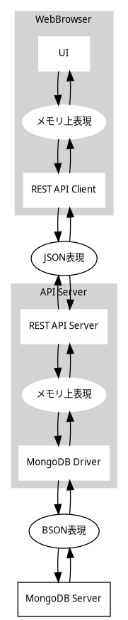

# データの表現方法
スキーマに基づいたデータの様々な表現方法について説明します。

## JSON表現
データが REST API を流れるときはJSON表現を使用します。
JSON表現のスキーマは JSONSchema で定義されます。以下のユーティリティ関数が提供されます。

|関数名|説明|
|---|---|
|teigi2jsonschema|teigiのスキーマ定義をJSONSchemaに変換する|

インタフェース定義からこの関数を使って OpenAPI の swagger.yml を生成できます。

## BSON表現

データがMongo DB に格納される場合はBSON表現を使用します。
BSON は  mongodb ドライバにより、Typescript 上では EJSON で表現されます。

## メモリ上表現
データをメモリ上に保持する場合、メモリ上表現を使用します。
メモリ上表現のスキーマは  typescript の型で表現されます。以下のユーティリティ関数が提供されます。

|関数名|説明|
|---|---|
|class2ts|teigiのクラス定義を typescript の型のソースコードに変換する|
|property2ts|teigiの属性定義を typescript の型のソースコードに変換する|
|ts2json|TypeScript の型付きオブジェクトをJSONオブジェクトに変換する|
|json2ts|JSONオブジェクトを TypeScript の型付きオブジェクトに変換する|
|ts2ejson|TypeScript の型付きオブジェクトをEJSONオブジェクトに変換する|
|ejson2ts|EJSONオブジェクトを TypeScript の型付きオブジェクトに変換する|

json2ts の入力はJSONSchema に従っている必要があります。json2ts では、Teigi のスキーマを読み込んで以下のチェックと変換が行われます。
* JSONSchema でのバリデーションチェック
* デフォルト値が設定されている属性が省略されている場合はデフォルト値を追加
* データ型の変換（文字列から日時、時刻、日付などへの変換、IPアドレス、数値から浮動小数点数/整数への変換）
* JSONSchema でチェックできないバリデーションチェック

ts2json は json2ts と逆の変換を行う。
* データ型の変換（日時、時刻、日付などを文字列に変換、浮動小数点数/整数から数値、IPアドレスへの変換）
* デフォルト値一致する値を持つ属性を削除

ts2json の出力を json2ts にかけると、完全に同じオブジェクトに戻ることが保証されます。

ejson2ts では、Teigi のスキーマを読み込んで以下のチェックと変換が行われます。
* デフォルト値が設定されている属性が省略されている場合はデフォルト値を追加
* EJSONから対応するデータ型への変換

ts2ejson は json2ts と逆の変換を行う。
* データ型に対応するEJSONへの変換
* デフォルト値一致する値を持つ属性を削除
ts2ejson の出力をejson2ts にかけると、完全に同じオブジェクトに戻ることが保証されます。

## 表示表現
データを Web UI に表示するときに使用する文字列表現です。以下のユーティリティ関数が提供されます。

|関数名|説明|
|---|---|
|ts2ui|teigiの属性定義と typescript のメモリ上表現から Web UI の表示値に変換する|

ts2ui は表示する文字列だけでなく、アイコンや背景色なども同時に返す場合があります。

## 入力文字列
Web UI から入力される場合の文字列表現です。
以下のユーティリティ関数が提供されます。

|関数名|説明|
|---|---|
|ui2ts|teigiの属性定義をもとに入力文字列列をtypescript のデータに変換する。|

ui2ts の変換は入力値チェック、変換、バリデーションの3つのフェーズからなります。

入力値チェックフェーズでは属性定義を元に入力値をチェックします。このチェックでデータのスキーマとして許容されていてる値でもデータの入力としては避けるといった仕様も実現できます。また、変換フェーズやバリデーションのエラーメッセージがエンドユーザにわかりにくい場合に事前にチェックしてわかりやすいメッセージを出すこともできます。

変換フェーズではクラス定義に基づいて変換します。このとき正規化や補間などの処理を行う場合もあります。変換できない場合はエンドユーザに提示すべきエラー文字列を返します。

## CSV表現
CSVファイルでダウンロード、アップロードされる場合の文字列表現です。以下のユーティリティ関数が提供されます。

|関数名|説明|
|---|---|
|ts2csv|teigiのクラス定義と typescript のデータからCSVファイルに変換する|
|csv2ts|teigiのクラス定義をもとにCSVファイルをtypescript のデータに変換する。正規化、補間を行う。変換できない場合はエンドユーザに提示すべきエラー文字列を行番号、列番号付きで返す。|

CSVファイルのアップロードで追加モードの場合、idとなる属性が同じものが存在する場合はそのオブジェクトを更新し、そうでない場合はオブジェクトを追加します。CSVファイルのアップロードで通常モードの場合は最初の列に追加、更新、削除の種別を付与してアップロードしていただきます。

CSVファイルのアップロードでオブジェクトを更新する場合で属性に値が指定されていない場合はアップロード前の値が指定されたものとみなすことができます（ルール記号：csv_no_value）。

## undefinedとdefault

teigi では、値が指定されていないことや未確定であることを表現するために undefined を使用することはできません。その場合は、null を使用することを検討してください。

JSON表現、EJSON表現では属性の値が型定義のデフォルト値と等しい場合は、属性を省略します。ts2json, ts2ejson でオブジェクト内にデフォルト値と等しい値を持つ属性が発見さくれるとその属性は削除されます。ここで、型定義にデフォルト値の指定がなくても、例えば nullable のように、型定義の内容によって自動的にデフォルト値が決まる場合がありますので注意してください。

メモリ上表現では typescript の undefined を使用しません。json2ts, ts2json でJSON表現の属性が省略されている場合は属性が追加され、その値はデフォルト値となります。デフォルト値を決定できないものが JSON表現で省略されている場合は変換に失敗します（ルール記号：undefined_default）。

## nullable

teigi では、値が指定されていないことや未確定であることを表現するために null を使用できます。null を使用する場合は、属性定義で nullable に True を指定してください。

boolean の False は、null と区別がつきにくいため、 nullable にしないことが推奨されます。
これらの推奨について、将来的に禁止とされる場合があり、エディタからは定義できません。

前項で示したとおり、JSON表現で属性値が省略されるかどうかはそのデフォルト値とメモリ上表現が一致しているかどうかに依存しており、 nullable かどうかとは独立であることに注意してください。
nullable な型のデフォルト値は、明示的なデフォルト値の指定がない限り null になります。

## 配列と辞書

id属性とorder属性

